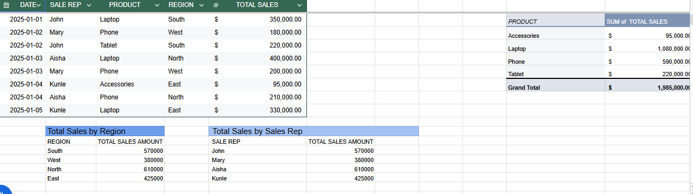
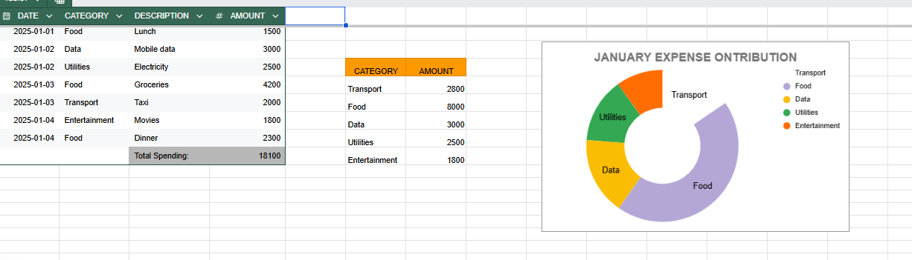
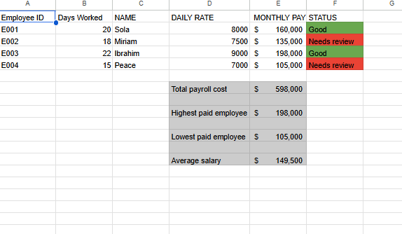
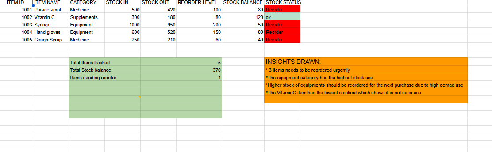
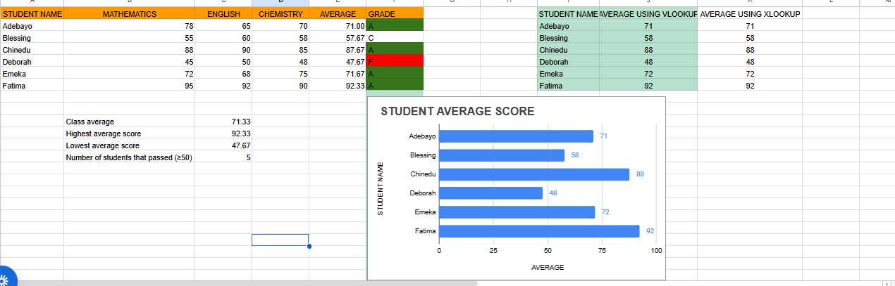

# Business Analytics Solutions

**Emmanuella Alao**

Data Analyst | Business Intelligence Analyst | AI Solutions Developer

---

## Overview

Most businesses don't need a data team; they need someone who can look at a messy sheet and make it make sense.

That's what this repo is: five independent Google Sheets builds, each one solving a different everyday operations problem: sales, spending, payroll, stock, performance. No shared codebase, no single "system" tying them together. Just five snapshots of the same core skill applied to five different rooms in the business: pull the numbers together, find what actually matters, and hand back something a non-technical stakeholder can read in under a minute.

---

## Tools Used

· Google Sheets 
· Pivot Tables 
· Charts & Visualizations 
· Formulas & Functions 
· Conditional Formatting 
· Dashboard Design

---

## Project 1: Sales Performance Analysis

**Objective:** Track revenue by product, region, and sales rep to spot performance patterns.

**What I Did:** Built a pivot-table-driven dashboard summarizing sales by product and region, with rep-level performance broken out separately.

**Key Insights:**
- Laptops drove the bulk of revenue — over half of total sales (£1.08M of £1.985M)
- The North region outperformed every other territory (£610K), narrowly ahead of South (£570K)
- Aisha was the top-performing rep by total sales, slightly ahead of John

---

## Project 2: Expense Tracker

**Objective:** Track spending by category and simplify budget monitoring.

**What I Did:** Built an automated category-based expense log with a donut chart breaking down where money actually goes each month.

**Key Insights:**
- Food accounted for nearly half of January spending (£8,000 of £18,100 total)
- Transport and Data were the next largest categories, both in the £2,800–£3,000 range
- Entertainment was the smallest spending category by a wide margin

---

## Project 3: Payroll Management System

**Objective:** Automate salary calculations and flag payroll issues before they become problems.

**What I Did:** Built a payroll calculator from daily rate and days worked, with conditional formatting to flag employees needing review.

**Key Insights:**
- Total payroll cost across the tracked team: £598,000
- Average salary sat at £149,500, with a £93,000 spread between the highest and lowest paid employee
- Two of four employees were automatically flagged "Needs Review" — the system catches outliers without manual checking

---

## Project 4: Inventory Management System

**Objective:** Monitor stock levels and flag reorder needs before items run out.

**What I Did:** Built a stock tracker comparing stock in vs. stock out against reorder thresholds, with automatic status flags.

**Key Insights:**
- 4 of 5 tracked items dropped below their reorder level — a stock position that needs urgent attention
- Equipment items (syringes, gloves) saw the heaviest stock movement, signaling high demand
- Vitamin C had the lowest stockout rate, suggesting it's overstocked relative to actual use

---

## Project 5: Student Performance Analysis

**Objective:** Track academic performance and identify students who need support.

**What I Did:** Built a scoring system across three subjects with automated grading, cross-validated using both VLOOKUP and XLOOKUP formulas.

**Key Insights:**
- Class average landed at 71.33, with scores ranging from 47.67 to 92.33
- 5 of 6 students passed (≥50 average); one student scored an F and stands out as needing follow-up
- The top and bottom performers differed by nearly 45 points — a gap worth investigating at the individual level

---

## Key Skills Demonstrated

· Data Cleaning & Organization 
· Dashboard Development 
· Business Reporting 
· Data Visualization 
· Spreadsheet Automation 
· Analytical Problem Solving 
· Performance Monitoring

---

## Why Spreadsheets

Not every business problem needs a full BI stack. For teams tracking a handful of products, a small headcount, or a single department's spending, Google Sheets and Excel remain some of the fastest, most accessible tools for turning raw numbers into a working report — no infrastructure, no setup cost, no learning curve for the people who actually have to use it day to day.

These five projects show that approach in practice: pivot tables, conditional formatting, and formulas doing real analytical work without needing a heavier platform. As data volume or complexity grows, that same logic scales naturally into Power BI, Tableau, or a SQL-backed system — but for a huge range of small and mid-sized business problems, a well-built spreadsheet is the right tool, not a placeholder for one.

---

## Files Included

- `Sales Performance Analysis.xlsx`
- `Expense_Tracker.xlsx`
- `Payroll Management System.xlsx`
- `Inventory Management System.xlsx`
- `Student Performance Analysis.xlsx`

---

## Author

**Emmanuella Alao**
Data Analyst | Business Intelligence Analyst | AI Solutions Developer
